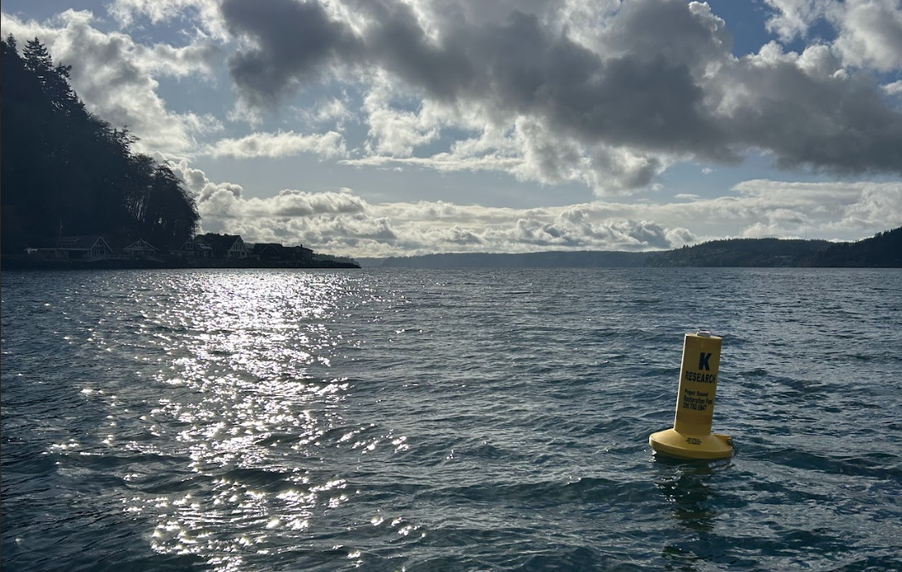

<table>
  <tr>
    <td>
      
    </td>
    <td>
      <h1>
        Kelp Index Sites: <br> Sensor Data Processing
      </h1>
    </td>
  </tr>
</table>


# Purpose

This repository is designed to clean and consolidate Kelp Index Logger data collected by PSRF and its partner organizations. These data, stored as .csv files in a shared Google Drive folder, come from a variety of environmental sensors monitoring temperature, pH, dissolved oxygen, water level, PAR, and conductivity at multiple sites across the Puget Sound.

The goal of this pipeline is to make it easy to ingest, clean, and merge raw logger data from multiple sources into a single tidy time series dataset suitable for analysis.


# Functionality

Currently, this pipeline can:

- Search a specified Google Drive folder for sensor logger `.csv` files to be processed.
- Compare against previously processed files and only process new file, allowing for incremental updates.
- Use metadata from a Google Sheet to help filter and clean each sensor's data.
- Combine data from different sensors into a single table organized by time, site, and depth position.
- Filter out time periods where the sensor was recorded as out of the water.
- Align all data to a regular 15-minute interval time series.
- Save the updated combined dataset as an `.rds` and `.csv` file for analysis.
- Track which files have already been successfully processed.

The result is a cleaned, combined, and timestamp-aligned dataset of environmental sensor data by site and position in water column, saved locally as an `.rds` and `.csv` file.


# Next Steps

Future additions to this pipeline will focus on:

- **Handling flagged files**: Add logic to identify and exclude logger files marked as problematic, as indicated in the metadata.
- **Threshold-based filtering**: Implement rules to automatically flag or filter sensor readings that fall outside of expected environmental ranges.
- **Calibration and derived values**: Add the ability to adjust raw sensor data for accuracy and convert measurements into more useful forms—such as estimating salinity from conductivity readings.


---

# What's Here?

```
.
└── index-data-processing/
    ├── data/
    │   ├── logger-data.rds                  # Most recently updated logger data
    │   └── processed-files.rds              # List of files included in logger-data.rds
    ├── .gitignore
    ├── index_data_processing_functions.r    # Individual and wrapper functions for finding, cleaning, and combining logger csv files and associated metadata from the PSRF Google Drive
    ├── pipeline_building.qmd                # Scratch file - Marina used to debug and test functions while building pipeline
    └── update_index_logger_data.qmd         # MAIN FILE - Use to update main Kelp Index Data file in PSRF Google Drive

```

# How to use:

To update the main logger data file with new logger data...

1. Clone this repository
2. Open locally in RStuido (or other preferred GUI)
3. Follow the instructions in `update_index_logger_data.qmd`
4. Push updated `logger-data.rds` and `processed-files.rds` to this repository for the next user
 

